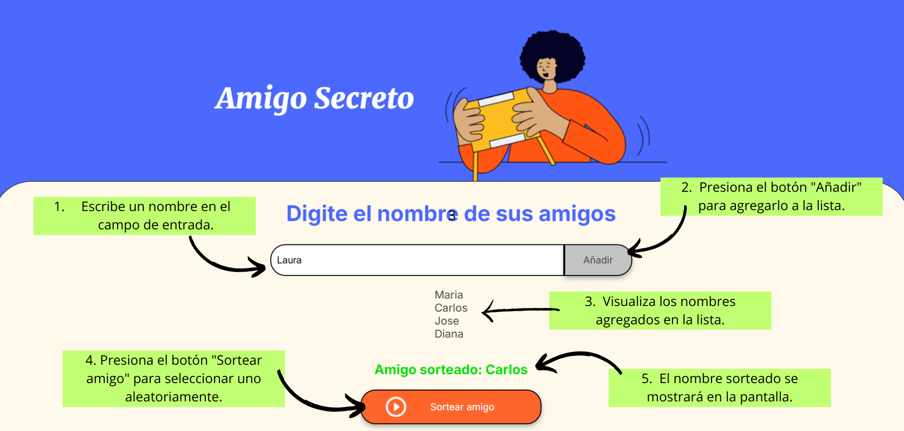

Este proyecto permite agregar nombres a una lista de amigos y seleccionar aleatoriamente uno de ellos

# Características

* Agregar nombres a la lista
* Mostrar la lista de amigos en pantalla
* Sortear un amigo de manera aleatoria

# Instrucciones de uso

# Tecnologías utilizadas

* HTML
* CSS
* JavaScript

# Desarrollado por

.jpeg>) 

Vivian Quiroga

[def]: logo.png